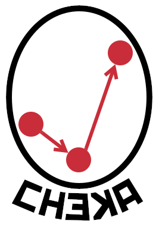
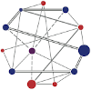

  
# CHEKA
A profile hierarchy-based RDF graph validation tool written in Python


1. [Installation](#installation)
2. [Use](#use)
3. [Testing](#testing)
4. [License](#license)
6. [Citation](#citation)
5. [Contacts](#contacts)


This tool validates a data graph against a set of SHACL shape graphs that it extracts from a hierarchy of Profiles (Standards/Specifications and/or profiles of them). It uses conformance claims in the data graph to a Profile to collate and then use all the 
*validator* SHACL files within the hierarchy of other Profiles and Standards to which that Profile profiles.

Cheka uses [Profiles Vocabulary (PROF)](https://www.w3.org/TR/dx-prof/) descriptions of Profiles and Standards and both 
traverses up a Profile hierarchy (following `prof:isProfileOf` properties) and across from `prof:Profiles`s to 
`prof:ResourceDescriptors` that describe the constraints implemented for them. These constraints are currently limited 
to [Shapes Constraint Language (SHACL)](https://www.w3.org/TR/shacl/) files and must have the `prof:Role` of 
`role:validation` to be recognised by Cheka. The [pySHACL](https://github.com/RDFLib/pySHACL) Python SHACL validator is 
used to perform SHACL validation.


## Installation
1. Ensure Python 3 in available on your system
2. Clone this repo
2. Install requirements in *requirements.txt*, e.g. `~$ pip3 install -r requirements.txt`
3. Execute scripts as per *Use* below


## Use
### Input requirements
To use Cheka, you must supply it with both a data (an RDF graph) to be validated and a profiles hierarchy (another RDF graph). It will then use 
one of several selected strategies to validate objects within the data using validating resources it locates using the 
profiles hierarchy.

You *may* supply it with a couple of other flags too for other functions.

The command line arguments (Python & BASH) are:

**Flag** | **Input values** | **Requirement** | **Notes**  
--- | --- | --- | ---
`-d` / `--data` | an RDF file's path | mandatory | Can be in most RDF formats with conventional file endings (e.g. `.ttl` for Turtle, `.jsonld` for JSON-LD)
`-p` / `--profiles` | an SHACL file's path | mandatory | As above. Profiles description must be formulated according to [PROF](https://www.w3.org/TR/dx-prof/) 
`-s` / `--strategy` | 'shacl' or 'profile' | optional, 'shacl' default | Which strategy to use. See [Strategies](#strategies) description below
`-u` / `--profile-uri` | the URI of a profile in the profile hierarchy | sometimes mandatory | If strategy 'profile' is selected, a profile URI must be give. The data is then validated using validators within that profile's hierarchy only
`-r` / `--get-remotes` | optional, default False | If True, Cheka will pull in profile and validating SHACL artifacts referenced, but not described, in the profiles hierarchy, i.e. remote profiles online
 

#### Data graph
This must be an RDF file with the part(s) to be validated indicating their conformance to a *profile* as per the 
Profiles Vocabulary.

Typically this will look like this:

```
@prefix dct: <http://purl.org/dc/terms/> .

<Object_X>
    a <Class_Y> ;
    dct:conformsTo <Profile_Z> ;
    ...
```

This says that `<Object_X>` is meant to conform to `<Profile_Z>`.

See the `tests/` folder for example data graphs.


#### Profiles hierarchy
This must also be an RDF file that contains a hierarchy of `prof:Profile` objects (including `dct:Standard` objects) 
that are related to one another via the `prof:isProfileOf` property and each of which has a validating resource 
indicated by relating it to a `prof:Profile` via a `prof:ResourceDescriptor` like this:

```
@prefix dct: <http://purl.org/dc/terms/> .
@prefix prof: <http://www.w3.org/ns/dx/prof/> .
@prefix role:  <http://www.w3.org/ns/dx/prof/role/> .


<Standard_A>
    a dct:Standard ;
    prof:hasResource [
        a prof:ResourceDescriptor ;
        prof:hasRole role:validation ;
        prof:hasArtifact <File_or_Uri_J> ;
    ]
.

<Profile_B>
    a prof:Profile ;
    prof:isProfileOf <Standard_A> ;
    prof:hasResource <Resource_Descriptor_P> ;
.   

<Resource_Descriptor_P>
    a prof:ResourceDescriptor ;
    prof:hasRole role:validation ;
    prof:hasArtifact <File_or_Uri_K> ;
.

<Profile_C>
    a prof:Profile ; 
    prof:isProfileOf <Profile_B> ;    
    prof:hasResource [
        a prof:ResourceDescriptor ;
        prof:hasRole role:validation ;
        prof:hasArtifact <File_or_Uri_L> ;
    ] ;
.
```

This says `<Profile_C>` is a profile of `<Profile_B>` which is, in turn, a profile of `<Standard_A>`. The two profiles 
and the standard have resources `<File_or_Uri_J>`, `<File_or_Uri_K>` & `<File_or_Uri_L>` respectively which are 
indicated to be validators by the `prof:ResourceDescriptor` classes that associate them with their profiles/standard.

See the `tests/` folder for example profiles graphs.


#### Strategies
The following different strategies may be selected for use.

**Name** | **Description**
--- | ---
*shacl* | Standard SHACL validation: all the SHACL validators from all the profiles found in the profiles hierarchy are used to validate the the given data using the SHACL validator targeting (usually per class)
*profile* | xxx
*claims* | *Not implemented yet*

***shacl*** is the default strategy

Note that the strategy is applied using the `s` flag. When using Cheka as a Python module, a different strategy may be applied per call to `Cheka.validate()`.


### Running
Cheka uses the profiles graph to find all the SHACL validators it needs to validate a data graph. It returns a pySHACL 
result with an additional element - the URI of the profile used for validation: [conforms, results_graph, results_text, profile_uri]. *conforms* is either True or False.

#### As a Python module
A Python program can import Cheka (`import cheka`) after installing it (`pip install cheka`). Then Cheka can be called in code like this:

```python
import cheka

c = cheka.Cheka("data.ttl", "profiles_hierarchy.ttl")

# to tell Cheka to pull in profiles/validators 
# referenced but not defined in the profiles_hierarchy.ttl
c.get_remote_profiles = True  
c.validate(
    strategy="profile", 
    profile_uri="http://example.org/profile/Profile_C"
)
# a second validation - basic, default, shacl validation
c.validate()
```

#### As a Python command line utility
```
~$ python3 cli.py -d DATA-GRAPH-FILE -p PROFILES-GRAPH-FILE
```
*(and potentially other optional args)*

If you make the cli.py script executable (`sudo chmod a+x cli.py`) then you can run it like this:

```
~$ ./cli.py -d DATA-GRAPH-FILE -p PROFILES-GRAPH-FILE
```

#### As a BASH script
The file `cheka` in the `bin/` directory is a BASH shell script that calls `cli.py`. Make it executable 
(`sudo chmod a+x cheka`) then you can run it like this:

```
~$ ./cheka -d DATA-GRAPH-FILE -p PROFILES-GRAPH-FILE
```
*(and potentially other optional args)*

#### As a Windows executable
*coming!*


## Testing
Tests are included in the `tests/` directory. They use [pytest](https://docs.pytest.org/en/latest/) should be able to be run from the command line. They have 
no dependencies, other than pytest and Cheka itself.

Tests are annotated with what they are testing.

### Test profile hierarchy
The profiles and validators used for the tests in this code are combined in the file [test-profile.hierarchy.ttl](cheka/test/test-profile.hierarchy.ttl). This hierarchy can be used in other applications as an example of a profile hierarchy.


## License  
This code is licensed using the GPL v3 licence. See the [LICENSE file](LICENSE) for the deed. 

Note [Citation](#citation) below for attribution.


## Citation
To cite this software, please use the following BibTex:

```
@software{10.5281/zenodo.3676330,
  author = {{Nicholas J. Car}},
  title = {Cheka: A profile hierarchy-based RDF graph validation tool written in Python},
  version = {0.5},
  date = {2020},
  publisher = "SURROUND Australia Pty. Ltd.",
  doi = {10.5281/zenodo.3676330},
  url = {https://doi.org/10.5281/zenodo.3676330}
}
```

Or the following RDF:

```
@prefix dcterms: <http://purl.org/dc/terms/> .
@prefix owl: <http://www.w3.org/2002/07/owl#> .
@prefix sdo: <https://schema.org/> .
@prefix wiki: <https://www.wikidata.org/wiki/> .
@prefix xsd: <http://www.w3.org/2001/XMLSchema#> .

<https://doi.org/10.5281/zenodo.3676330>
    a sdo:SoftwareSourceCode , owl:NamedIndividual ;
    sdo:codeRepository <https://github.com/surroundaustralia/cheka> ;
    dcterms:type wiki:Q7397 ; # "software"
    dcterms:creator "Nicholas J. Car" ;
    dcterms:date "2020"^^xsd:gYear ;
    dcterms:title "Cheka: A profile hierarchy-based RDF graph validation tool written in Python" ;
    sdo:version "0.5" ;
    dcterms:publisher [
        a sdo:Organization ;
        sdo:name "SURROUND Pty Ltd" ;
        sdo:url <https://surroundaustralia.com> ;
    ]
.
```


## Contacts

*publisher:*  
  
**SURROUND Australia Pty. Ltd.**  
<https://surroundaustralia.com>  

*creator:*  
**Dr Nicholas J. Car**  
*Data Systems Architect*  
SURROUND Australia Pty. Ltd.  
<nicholas.car@surroudaustralia.com>  
